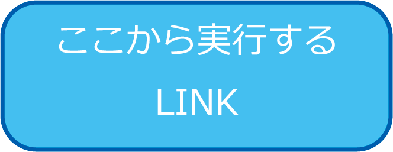
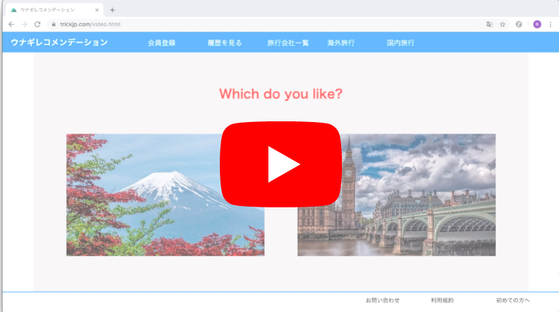

# Unagi-Recommendation うなレコ

# Demo動画&リンク
[うなぎレコメンデーション](https://trickjp.com/start.html)
左のリンクより実際に体験できます。

## 目次
- [製品概要](#製品概要)
- [背景](#背景)
- [使い方](#使い方)
- [特長](#特長)
- [解決出来ること](#解決出来ること)
- [今後の展望](#今後の展望)
- [開発内容](#開発内容)
- [活用した技術](#活用した技術)
- [独自開発技術-ハックデイで開発したもの](#独自開発技術-ハックデイで開発したもの)

## 製品概要
### Travel × Tech

### 背景
 台風19号で結構前から準備をしていた学科旅行が消えて悲しかった。もう一度、全員の好みを聞いて調整するのはめんどくさい。

どこに旅行に行きたいかを決めるのが、すぐにはわからない上に、時間がかかるのが問題点。実際にははっきりとどこに行きたいかがわかっている人はほとんどいないので、その時の気分で選んでいる。

 気分で選んでいるのに、比較する観光地は自分がよく知っている観光地に限られてしまう。

 ↓

 自分の旅行先の気分や好みを読み取ってマッチした観光地をリコメンドしてくれるサービスを作れば良い

### 製品概要
 うなレコは視線推定の技術を使って、あなたの好みにあった旅行先をリコメンドするサービスです

 長ったらしい文章を読むことなく、ハンズフリーで30秒ほどの時間で診断は完了するので、あなたは好きな時間に旅行先を決めることができます。

 一緒に旅行する友達にやってもらうことも簡単です。

### 使い方
#### 1. あなたの好みを測るために、２つの写真のペアが１５組現れます。好きな写真の方をみてください

#### 2. 写真の選び方から、あなたが今本当に行くべき旅行先を提案します

#### 3. グループで旅行する場合にも素早く判定することができます

### 特長

#### 1. 特長1
タイピング、クリック不要!
ただ、気になる方の写真をみるだけで旅行先を提案できます！

#### 2. 特長2
提案された旅行先の観光情報や写真がページから見れるので、旅行先の決定を迅速に行えます！
#### 3. 特徴3
提案された旅行先の情報は自分で調べることなく、自動で表示されます！
#### 4. 特長4
ぼっち旅行だけでなく、グループでの旅行にも対応しています！

### 解決出来ること

* タイピング、クリック不要なので、手が不自由な方や、使いづらい状態でも使用できます
* 自分で旅行先の情報を調べて比較することなく、ユーザーは潜在的な嗜好から旅行先を自動で選ぶことができます
* 検索ではなかなか出てこないようなマイナーな観光地の情報も得ることができます
* 旅行先を複数人で決める際に、意見が別れて時間がかかりますが「うなレコ」なら複数人でも一瞬で旅行先を決めることが出来ます。

### 今後の展望
* 現在は診断された結果に対して、観光地の画像と観光情報を乗せているだけですが、宿の情報や旅行サイトの口コミ情報も表示する
* グループで使用した場合のグループ全体での最適な旅行先を提案できるようにする。不満が出そうな人にフォローできるようにする
* 提案された旅行先についての観光情報をさらに充実させる（口コミ情報、推定される旅行費用など）
* 他の旅行サイトなどへリンクを貼ることで収益化を可能にする

## 開発内容

### 活用した技術

#### API-データ

* goo　キーワード抽出API
* NEC 遠隔視線推定技術API
* AWS(S3,Lambda,Crowd Front,API geteway,root 53)

#### フレームワーク-ライブラリ-モジュール
* Jquery
* python
* JS
* BeautiuflSoup

#### デバイス
* PC(Webブラウザ)

### 独自開発技術-ハックデイで開発したもの

#### 2日間に開発した独自の機能技術
* AWSを用いてサーバーレスな構成にすることで、オートスケールを実現しスケーラブルなシステムを開発した、
* SSL通信を実現し、画像のプライバシーに考慮した通信を行った
* ユーザーの好みを画像に向ける視線によって取得できるようにした
* ユーザーの好みに一致した観光地をリコメンドするシステムの開発
* 観光地の画像や観光情報をスクレイピングにより取得
* ユーザーの好みとマッチする観光地の特性を表現する文章を自動生成
* 複数人での旅行プラン作成に寄与するために、全員の満足度が高く、かつ、特定の人の負担が大きくなりすぎるとエラーを出すようなシステムを開発した
